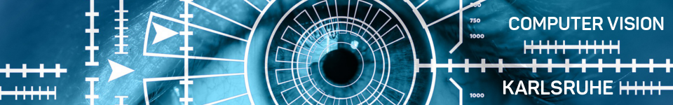

# Computer Vision Karlsruhe

Das Repository der Meetup Gruppe "Computer Vision Karlsruhe" (https://www.meetup.com/Computer-Vision-Karlsruhe/).

Unser erstes Meetup war am 07.11.2017. Zur Einführung ins Thema OpenCV haben wir eine 
[Entwicklungsumgebung eingerichtet](docs/computer-vision-dev-env-einrichten.md) und uns einige 
[Basics in OpenCV](docs/CV_KA_Meetup_1_7_November_2017/opencv-introduction/1_OpenCV_Introduction.ipynb) angesehen. Hier 
auch noch eine [OpenCV Einführung](https://blog.codecentric.de/2017/06/einfuehrung-in-computer-vision-mit-opencv-und-python/)

## Kommunikation

* Unser Slack Channel: [https://cv-karlsruhe.slack.com](https://cv-karlsruhe.slack.com)
* Twitter Hash Tag: [https://twitter.com/hashtag/CVKA](https://twitter.com/hashtag/CVKA)
* Github Repo: [https://github.com/codecentric/computer-vision-karlsruhe](https://github.com/codecentric/computer-vision-karlsruhe)

## Kontakt

* Oli Moser [https://twitter.com/moseroli](https://twitter.com/moseroli)
* Nico Axtmann

